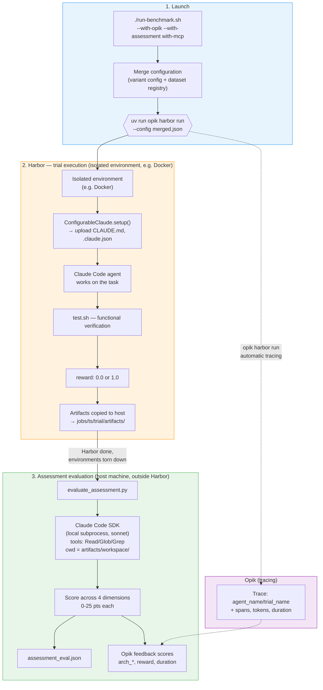
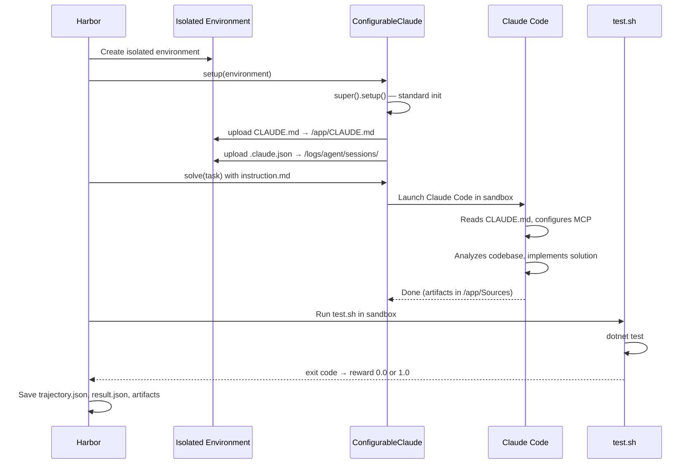
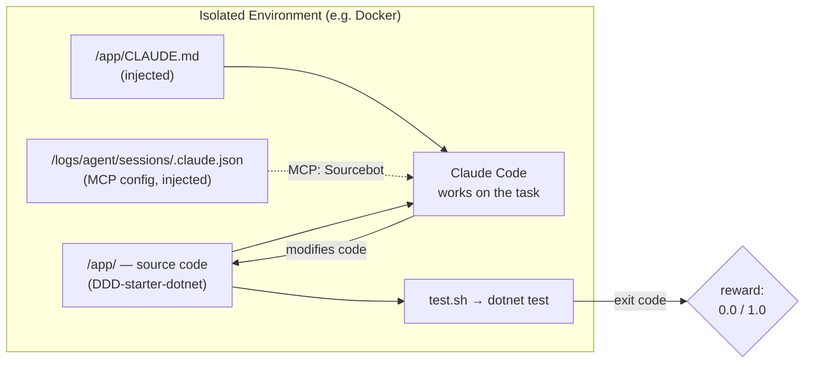
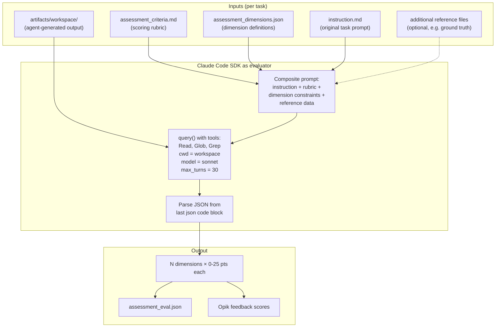
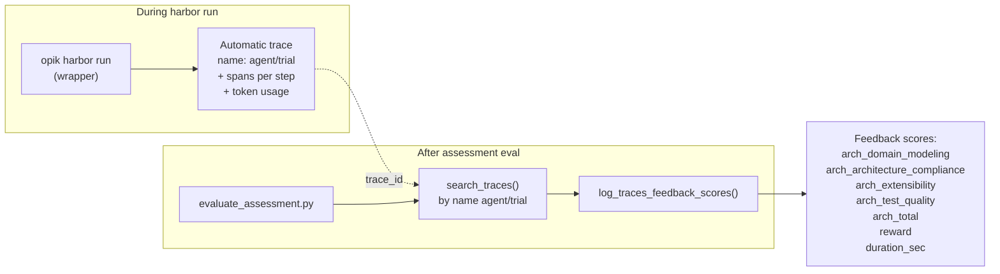
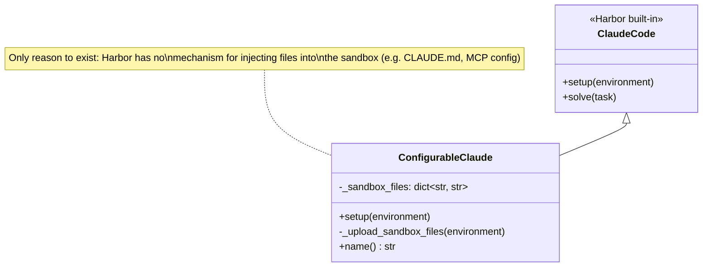
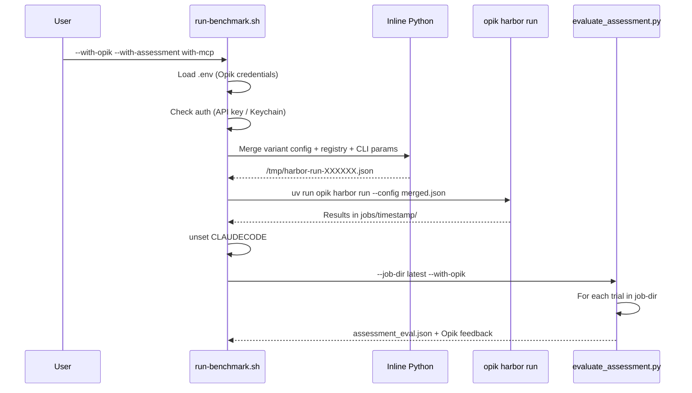

# Eval System Architecture

## Overview

The system evaluates AI agent (Claude Code) quality on programming tasks. It uses **Harbor** as the engine running agents in isolated environments (sandboxed containers) and **Opik** as the observability platform for tracking results.

Key design: evaluation is **two-stage** — Harbor assesses functional correctness (tests pass/fail), then a separate evaluator (Claude Code SDK) assesses architectural quality of the generated code.

---

## End-to-end flow



---

## What happens inside Harbor

Harbor is a framework for evaluating AI agents. Out of the box you provide an agent, a dataset, and run `harbor run`. This project adds minimal but important customizations on top.

### Trial lifecycle



### Inside the isolated environment



Harbor only measures **functional correctness** — tests pass or fail, yielding a binary reward. Whether the agent wrote the code *well* is not something Harbor measures. That's where assessment evaluation comes in.

---

## Assessment evaluation — LLM-as-a-Judge

This is the key extension beyond default Harbor and it runs **entirely on the host machine**, outside of Harbor. After Harbor finishes all trials and environments are torn down, `run-benchmark.sh` invokes `evaluate_assessment.py` as a separate step. The evaluator uses Claude Code SDK (a local subprocess, not a container) to analyze artifacts that Harbor already copied from the environment to `jobs/<ts>/<trial>/artifacts/workspace/` on the host filesystem.



The evaluator gets `Read`, `Glob`, `Grep` tools and freely explores the workspace containing the agent's artifacts. It scores according to a rubric defined per task.

Each benchmark defines its own dimensions in `assessment_dimensions.json` and per-task rubrics in `assessment_criteria.md`. Tasks can also include optional reference files (e.g. ground truth) that the evaluator uses to judge completeness and accuracy.

---

## Opik integration



Two integration points:
1. **`opik harbor run`** — Opik's wrapper around Harbor. Automatically creates traces with agent steps, token usage, and duration
2. **`evaluate_assessment.py --with-opik`** — finds the existing trace by name `agent_name/trial_name`, attaches feedback scores

---

## `ConfigurableClaude` — the only custom class



Harbor natively handles auth, MCP servers, model selection, and timeout. `ConfigurableClaude` adds **one thing**: declarative file mapping from host to the isolated environment via `sandbox_files` in the JSON config.

---

## Agent variants

Each benchmark defines its **own set of variants** — there are no globally shared variants. A variant represents a specific agent configuration to be compared against other variants on the same set of tasks. This is a core architectural concept: the same tasks are solved by agents with different instructions, tools, or constraints, and the results are compared.

Each variant is a directory under `<benchmark>/variants/<variant-name>/` containing:
- `harbor_config.json` — agent import path + `sandbox_files` mapping (required)
- `CLAUDE.md` — instructions injected into the environment (required)
- `claude_config.json` — MCP server configuration (optional)

Variants can differ along many axes:
- **Instruction specificity**: minimal vs detailed architectural guidance
- **Tool access**: no MCP vs code search MCP vs documentation MCP
- **Constraints**: specific restrictions or requirements
- **Prompting techniques**: chain-of-thought, examples, domain glossary

The `run-benchmark.sh` script takes a variant name as a positional argument and runs all (or filtered) tasks with that variant's configuration.

---

## Orchestration — `run-benchmark.sh`



The script builds a **merged config** by combining three sources:
- `variants/<name>/harbor_config.json` — agent definition (import path, sandbox_files)
- `local-registry.json` — task list from the dataset
- CLI parameters — model, timeout, task filter

---

## Changes from default Harbor + Opik

### Harbor customizations

| Aspect | Default Harbor | This project |
|--------|---------------|-------------|
| Agent | `ClaudeCode` (built-in) | `ConfigurableClaude` — adds `sandbox_files` for file injection |
| Evaluation | Only `test.sh` → reward 0/1 | + assessment eval (LLM-as-a-Judge, N dimensions × 25 pts) |
| Configuration | Static JSON | Dynamic merge (variant + registry + CLI params) in run-benchmark.sh |
| Auth | Manual env variable setup | Auto-extraction of `CLAUDE_CODE_OAUTH_TOKEN` from macOS Keychain via `export_oauth_token.sh` |

### Opik customizations

| Aspect | Default Opik + Harbor | This project |
|--------|----------------------|-------------|
| Token usage | Bug: always `None` (opik 1.10.26) | Patch: deferred span creation via `__setattr__` hook |
| Feedback scores | None | `arch_*`, `reward`, `duration_sec` attached post-hoc |
| Verification | Opik UI | REST API (programmatic) |

### Claude Code SDK workarounds

| Aspect | Default SDK 0.0.25 | This project |
|--------|-------------------|-------------|
| Unknown message types | Crash (`MessageParseError`) | Monkeypatch: returns `None` instead of raising |
| Nested session detection | Detects `CLAUDECODE` env → refuses | `unset CLAUDECODE` + `env={"CLAUDECODE": ""}` |

---

## Trial result structure

```
jobs/2026-03-12__14-30-00/
└── ddd-threshold-discount__with-mcp__0/
    ├── result.json              # reward, duration, task_id, source
    ├── config.json              # Agent config used for this trial
    ├── assessment_eval.json     # LLM-as-a-Judge evaluation result
    ├── agent/
    │   └── trajectory.json      # ATIF: agent steps, tool calls, tokens
    └── artifacts/
        └── workspace/           # Modified files from /app/Sources
```

---

## Directory structure

```
evals/
├── claude_custom_agents.py          # ConfigurableClaude — agent with file injection
├── export_oauth_token.sh            # OAuth token extraction from macOS Keychain
│
├── eval-platforms/                  # Shared framework (benchmark-agnostic)
│   ├── evaluate_assessment.py       # Assessment evaluator (Claude Code SDK + Opik)
│   ├── atif_parser.py               # ATIF trajectory parser
│   ├── .env                         # Opik credentials
│   └── patches/                     # Vendor library patches
│       ├── apply_opik_patches.sh
│       └── opik_harbor_deferred_metrics.patch
│
├── ddd-architectural-challenges/    # Benchmark: DDD architecture
│   ├── run-benchmark.sh
│   ├── local-registry.json          # Harbor task registry
│   ├── assessment_dimensions.json   # Evaluation dimension definitions
│   ├── tasks/
│   │   ├── ddd-threshold-discount/  # Task: extend a discount discriminated union
│   │   └── ddd-weather-discount/    # Task: weather API integration in domain layer
│   └── variants/
│       ├── baseline/
│       ├── guided/
│       └── with-mcp/
│
└── decision-extraction/             # Benchmark: architectural decision extraction
    ├── run-benchmark.sh
    ├── tasks/extract-decisions-from-review/
    └── variants/{vanilla, with-skill}/
```
