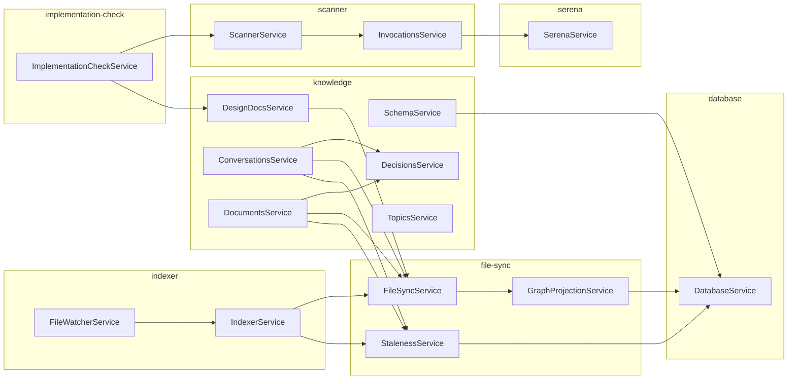
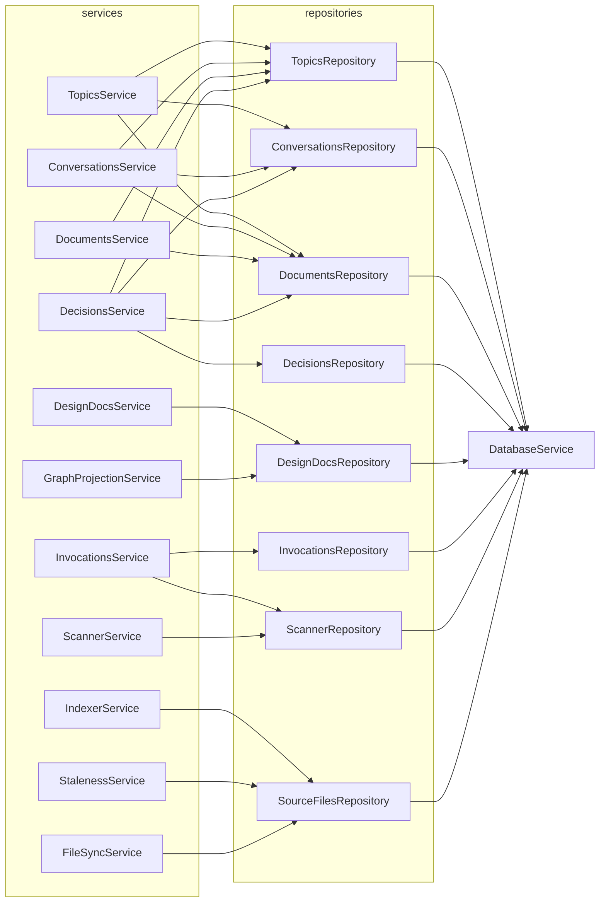

# noesis-graph service dependencies

Service-to-service dependency graph (NestJS DI). Repository and config-token
dependencies (e.g. `DATA_DIR`, `PROJECT_DIR`, `*Repository`) are intentionally
omitted — only `*.service.ts` → `*.service.ts` edges are shown.



## Services with no service-level dependencies

These have only repository / config-token dependencies:

- `DatabaseService` — only `DATA_DIR`
- `SerenaService` — only `PROJECT_DIR`
- `TopicsService` — only repositories
- `DecisionsService` — only repositories

## Service → Repository dependencies

Repositories are injected only by services (per architecture rules). Every
repository takes a single `DatabaseService` dependency, shown collectively at
the bottom rather than as 8 individual edges.



### Services with no repository dependencies

- `DatabaseService`, `SerenaService` — leaf services.
- `SchemaService` — uses `DatabaseService` directly (introspection via `CALL show_tables()`), bypassing repositories.
- `FileWatcherService` — coordinates `IndexerService` only.
- `ImplementationCheckService` — orchestrates `ScannerService` + `DesignDocsService` only.

## Methods used per service-to-service dependency

For every edge in the first diagram, the methods actually called on the
dependency. Repository and config-token usage is excluded.

```
ConversationsService
├── DecisionsService
│   └── addDecision
├── FileSyncService
│   └── registerWritten
└── StalenessService
    └── refreshStaleFlags

DocumentsService
├── DecisionsService
│   ├── addDecision
│   └── addItemsToDecisionSlot
├── FileSyncService
│   └── registerWritten
└── StalenessService
    └── refreshStaleFlags

DesignDocsService
└── FileSyncService
    └── registerWritten

SchemaService
└── DatabaseService
    └── query

GraphProjectionService
└── DatabaseService
    └── query

StalenessService
└── DatabaseService
    └── query

FileSyncService
└── GraphProjectionService
    └── project

IndexerService
├── FileSyncService
│   ├── loadFile
│   └── removeFile
└── StalenessService
    └── refreshStaleFlags

FileWatcherService
└── IndexerService
    └── runFullIndex

InvocationsService
└── SerenaService
    └── callTool

ScannerService
└── InvocationsService
    └── rebuildInvocations

ImplementationCheckService
├── ScannerService
│   └── scanInMemory
└── DesignDocsService
    └── readDesignDoc
```

## Notable observations:

- DatabaseService exposes only query to its three direct callers (Schema, GraphProjection, Staleness) — a minimal shared facade.
- FileSyncService.registerWritten is the integration point for write-flow services (Conversations, Documents, DesignDocs); loadFile/removeFile are reserved for IndexerService.
- DocumentsService is the only consumer of DecisionsService.addItemsToDecisionSlot.

## Critical review

The architectural rules (`CLAUDE.md`) state: *repositories are used only by
services within their own domain*, *services are the only callers of
repositories*, and code is *organised by capability, not technical pattern*.
Measured against that, the following issues stand out.

### 1. Cross-domain repository access (two leaks)

- **`GraphProjectionService` (`file-sync/`) → `DesignDocsRepository` (`knowledge/design-docs/`)**.
  Hard cross-domain dependency: a service in `file-sync/` reaches directly into
  another domain's repository. The same pattern is *not* used for any other
  knowledge entity — `Conversation`, `Document`, `Topic`, `Decision` are all
  written via `DatabaseService.query` from `GraphProjectionService` directly,
  not through their repositories. The `DesignDoc` exception suggests either:
  (a) the projection logic for design docs grew beyond raw Cypher and was
  pushed into the repo, or (b) the other entities should also delegate to
  their repositories. Either way it is inconsistent.

- **`InvocationsService` → `ScannerRepository`**.
  Same module (`scanner/`), so less severe, but `InvocationsService` calls
  `scannerRepo.getDomainModel()`, `scannerRepo.initSchema()`,
  `scannerRepo.getBehaviorsWithLocations()` — three distinct methods. This
  is a stable structural dependency, not a one-off. Either invocations should
  be a sub-aggregate inside a single `ScannerRepository`/`ScannerService`, or
  the `scanner/invocations/` subdomain should own its own model query helper.

### 2. Two parallel write paths to the same graph nodes

For most knowledge entities the write path looks like:
`<X>Service.add<X>FromFile()` writes the file → file-sync detects the change
→ `GraphProjectionService.project()` writes the graph nodes. So
`<X>Service` *never* mutates the graph directly for the file-driven path.
But `<X>Service` *also* validates and links sub-items (e.g.
`DecisionsService.addDecision` writes Decision/Alternative nodes via
`DecisionsRepository`). The split is real (file-driven vs. agent-driven
mutations) but it means two places own DB-write authority for overlapping
node types. A drift between projection logic and repository inserts will
silently produce inconsistent graphs. Worth an explicit invariant test.

`DesignDoc` is now the cleanest case: both `DesignDocsService.persist`
(after the splitter writes the file) and `GraphProjectionService.projectDesignDoc`
(after the indexer detects the file) call the *same*
`DesignDocsRepository.replaceDesignDoc(doc, date)`, which deletes the
bounded-context subtree and recreates it from the on-disk JSON. There is
one graph-write path with two callers — no per-caller variation in what
gets written, no parallel mutator logic. The drift hazard described in
the paragraph above does not apply here.

### 3. Service size outliers

| Service                 |      LOC | Public methods |
| ----------------------- | -------: | -------------: |
| `DesignDocsService`     | **1130** |         **16** |
| `ScannerService`        |      700 |              5 |
| `DecisionsService`      |      444 |             11 |
| `ConversationsService`  |      441 |              7 |
| `InvocationsService`    |      396 |              4 |
| `DocumentsService`      |      391 |              7 |
| `TopicsService`         |      379 |             15 |
| ...all others           |    ≤ 171 |           ≤ 6  |

`DesignDocsService` (1130 lines) and its repository (1186 lines) are still
the largest pair, ~2.2× the next-largest (`Scanner` at 1052 LOC combined),
though the gap closed materially when the file-sync refactor collapsed the
seven `upsert*(... isModification)` methods into pure `create*` helpers,
removed `applyDesignDoc` / `applyBoundedContextChangeSet` /
`applyQualityAttributesAt`, and dropped the `source_json` plumbing — the
repository alone shed ~210 LOC. The 16 public methods on the service still
cover at least four concerns: CRUD, path management, actor management,
bounded-context map, element editing, validation, file persistence.
Splitting along those seams (e.g. `DesignDocActorsService`,
`BoundedContextMapService`) would bring the file in line with the rest of
the codebase.

`ScannerService` at 700 LOC / 5 public methods suggests heavy private logic
— likely a candidate for extracting a domain-model-walker helper.

### 4. Repository granularity is uneven

Repository sizes range from 47 to 1186 lines, methods from 4 to 24:

- **Narrow** (4 methods): `SourceFilesRepository`, `InvocationsRepository`.
- **Wide** (19–24 methods): `TopicsRepository`, `DecisionsRepository`.
- **Outlier** (1186 LOC, 10 public methods → high private/public ratio):
  `DesignDocsRepository`. The class body itself is ~830 lines plus ~360
  lines of standalone Zod row schemas and `assertGreenfieldDoc` recursion
  helpers in the same file. Down from 1397 LOC after the file-sync refactor
  collapsed `upsert*` into `create*` and dropped `applyDesignDoc` plus the
  `source_json` round-trip; further granularity gains would require
  splitting along child entities (e.g. an `ActorsRepository` for the
  graph-global actor catalog, currently mixed in with the design-doc tree).

The `DecisionsRepository` (24 methods) owns three node types — `Decision`,
`AlternativeOption`, plus `DecisionSlot` linking — which violates the
"repository per aggregate" granularity used elsewhere. `AlternativeOption`
could plausibly be its own repository with `decisions` injected, or
inlined into projection.

### 5. Naming inconsistencies

- **Repository field naming inside services** is inconsistent:
  - Most own-domain repos: `repository: XRepository` (abstract role).
  - `InvocationsService` uses `scannerRepo: ScannerRepository` (abbreviated)
    AND `repo: InvocationsRepository` (abbreviated AND ambiguous about
    which repo it is). Both should be `scanner: ScannerRepository` /
    `repository: InvocationsRepository` to match the rest of the codebase.
  - Cross-domain repos elsewhere are named after the *entity*
    (`topics`, `documents`, `conversations`) — fine, but the
    `repo`/`scannerRepo` abbreviations are the only ones using a tech suffix.

- **Method naming inside `FileSyncService`**: `loadFile`, `removeFile`,
  `registerWritten`, `detect`. `registerWritten` is past-tense passive
  while the others are imperative; `recordWrite` or `markWritten` would
  align better. `detect` is too generic for a public API — `classify` or
  `detectKind` would be clearer.

- **Service name `GraphProjectionService` is generic**. It only projects
  `noesis/`-rooted source files into graph nodes. `SourceFileProjectionService`
  or `FileToGraphProjectionService` would convey the actual contract —
  particularly important because the term "projection" is also used in CQRS
  and in graph-DB read models, neither of which apply here.

- **`InvocationsService.repo`** vs everywhere else's `repository` —
  trivial but easy to fix.

### 6. Orphan / boundary services

- **`SchemaService`** uses `DatabaseService.query` directly with no
  repository in front. This is justified (Kuzu introspection, not a
  business aggregate) but contradicts the rule "services only call
  repositories". Either codify the exception in `CLAUDE.md` ("introspection
  services may bypass repositories") or move the queries into a
  `MetadataRepository`.

- **`FileWatcherService`** (105 LOC) is healthy and narrow but carries two
  responsibilities: bootstrap full-index AND ongoing watch. Clean to keep
  together while small; flag for splitting if either grows.

### 7. Hidden symmetry between `ConversationsService` and `DocumentsService`

Both services share the same dependency surface (`Decisions`, `FileSync`,
`Staleness`, plus topics/decisions/documents repositories). They both
implement a near-identical "add from file → split → register written → mark
stale" pipeline. Either:
(a) the symmetry is incidental and the two pipelines will diverge — fine,
keep them separate;
(b) the symmetry reflects a shared concept (`SourceArtifactService`) that
could absorb the common pipeline and let each domain keep only the
splitting/extraction logic.

The duplication is small enough today that (a) is reasonable, but worth
revisiting when adding a third source-file kind.

### 8. Method-level coupling asymmetry on `FileSyncService`

`FileSyncService` exposes four public methods: `detect`, `loadFile`,
`removeFile`, `registerWritten`. Of these:

- `IndexerService` uses **only** `loadFile` + `removeFile`.
- `ConversationsService`, `DocumentsService`, `DesignDocsService` use
  **only** `registerWritten`.

The two caller groups touch disjoint method sets. This is exactly the
shape of a class doing two jobs — index-side file loading vs. write-side
registry stamping. A split into `FileLoaderService` (used by indexer) and
`WriteRegistryService` (used by write-flow services) would each have a
single coherent responsibility, sharing `SourceFilesRepository` underneath.