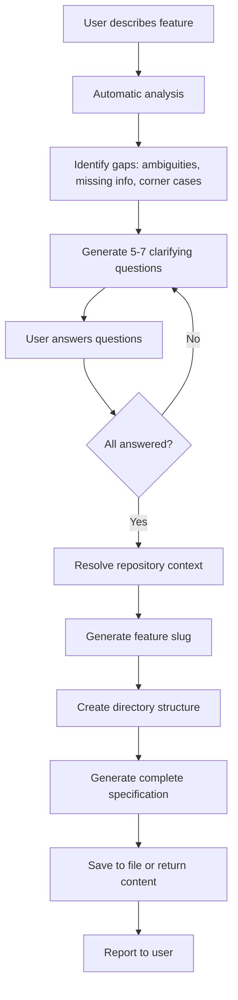

# Business Requirements Analysis

## Overview

Transform unclear feature descriptions into precise, testable requirements with comprehensive BDD scenarios. This skill systematically:
- Identifies ambiguities, missing information, and corner cases
- Conducts interactive clarification dialog
- Generates complete requirements specification with embedded BDD scenarios
- Ensures 100% traceability between requirements and scenarios

**Output**: Single markdown file at `{repo_root}/specs/{YYYY-MM-DD}_{feature-slug}/requirements.md`

## When to Use This Skill

✅ Use when:
- Starting a new feature with unclear requirements
- User stories are vague or incomplete  
- You need structured, testable acceptance criteria
- Before design or development begins
- Requirements keep changing (lock them down first)

❌ Don't use for:
- Technical design (use P3 Model Designer instead)
- Task breakdown (use Planning skill instead)
- Simple bug fixes with clear scope

## Quick Start

### 1. Describe Your Feature

Provide a brief description in plain language:

```
"I need customers to track their orders and get updates"

"Add a dashboard showing sales metrics for managers"

"Users should be able to share recipes with friends"
```

Don't worry about:
- Perfect grammar or completeness
- Technical details or implementation
- Having all the answers upfront

### 2. Answer Clarifying Questions

You'll receive 5-7 focused questions about:
- **Ambiguities**: Vague terms (e.g., "quickly" → specify actual time)
- **Missing information**: Error handling, limits, permissions
- **Corner cases**: Edge conditions, boundary scenarios

**Tips**:
- Choose from options OR specify your own
- Say "I don't know yet" if unsure (I'll make reasonable assumptions)
- Call out must-haves vs. nice-to-haves

### 3. Review & Approve

You'll receive a complete specification with:
- Functional requirements (REQ-001, REQ-002, ...)
- BDD scenarios (Given/When/Then format)
- Business rules and corner cases
- Traceability matrix

**Check for**:
- Does this match your intent?
- Are success criteria realistic?
- Any missing scenarios?

## Workflow



## Output Structure

The generated requirements file will be created at:

```
{repository_root}/specs/{YYYY-MM-DD}_{feature-slug}/requirements.md
```

**Repository context**:
- Assume execution is inside a repository and resolve the repo root automatically
- Prefer `git rev-parse --show-toplevel`, falling back to the current working directory when git metadata is unavailable
- If no reliable path can be resolved, skip file creation and return the requirements content in the response instead

**Components**:
- `{repository_root}`: Automatically detected; if unavailable, return output inline instead of writing files
- `{YYYY-MM-DD}`: Current date (e.g., 2024-10-21)
- `{feature-slug}`: Generated from feature name (lowercase, hyphens, max 30 chars)

**Example**: `/home/user/myproject/specs/2024-10-21_order-tracking/requirements.md`

**Structure**: Each functional requirement contains nested business rules and BDD scenarios for cohesive, self-contained documentation.

## Core Principles

1. **Requirements are WHAT and WHY, never HOW**
   - ❌ "Use PostgreSQL to store data"
   - ✅ "System must persist user preferences"

2. **Every requirement must be testable**
   - ❌ "System should be fast"
   - ✅ "System shall respond within 2 seconds (95th percentile)"

3. **Ambiguity is the enemy**
   - Surface vague terms: "quickly", "many", "user-friendly"
   - Replace with specific, measurable criteria

4. **Corner cases matter**
   - Zero case, boundary conditions, concurrent actions
   - "What if..." scenarios prevent bugs

5. **BDD scenarios are the contract**
   - Every requirement must have BDD scenario(s)
   - Scenarios become automated tests
   - 100% traceability required

## Gap Detection Patterns

For detailed patterns, see [references/gap-detection-patterns.md](references/gap-detection-patterns.md).

### Quick Reference

**Ambiguities**: Fuzzy quantities ("many"), vague time ("quickly"), unclear quality ("user-friendly")

**Missing Information**: Boundaries (min/max), error cases, constraints, outcomes

**Corner Cases**: Zero/one/max values, timing (simultaneous actions), special values (empty/null), state conflicts

## Language Standards

See [references/language-standards.md](references/language-standards.md) for complete rules.

**Quick Rules**:
- ✅ SHALL, MUST (mandatory)
- ✅ SHALL NOT, MUST NOT (prohibited)
- ❌ should, may, could (ambiguous)

**Replace vague terms**:
- "quickly" → "within 2 seconds"
- "many users" → "at least 1000 concurrent users"
- "large files" → "files up to 100MB"

## BDD Scenario Rules

See [references/bdd-scenario-rules.md](references/bdd-scenario-rules.md) for complete guidelines.

### Key Points

Every scenario must have:
- Descriptive title with sequential number
- Given/When/Then structure
- Nested directly under its parent requirement

Structure:
```markdown
### REQ-001: Add Item to Cart
...

#### BDD Scenarios

**Scenario 001: User adds item to empty cart**
```gherkin
Scenario: User adds item to empty cart
  Given the user has no items in their cart
  And the item "Laptop" is in stock
  When the user clicks "Add to Cart" for "Laptop"
  Then the cart SHALL contain 1 item
  And the cart total SHALL be $999.99
```
```

## Resource Map

- **Template**: [templates/requirements-template.md](templates/requirements-template.md) — canonical skeleton, acceptance checklist, and usage notes
- **Workflows**:
  - [workflows/clarification-dialog.md](workflows/clarification-dialog.md) — clarification process, question patterns, readiness checklist
  - [workflows/file-generation.md](workflows/file-generation.md) — slug generation, inline vs. file delivery, validation routine
- **Reference Guides**:
  - [references/gap-detection-patterns.md](references/gap-detection-patterns.md)
  - [references/language-standards.md](references/language-standards.md)
  - [references/bdd-scenario-rules.md](references/bdd-scenario-rules.md)

## Quality Gates

Before handing off the specification:

1. Confirm the Clarification Checklist in `workflows/clarification-dialog.md` is complete.
2. Generate and validate the document using `workflows/file-generation.md` (respect inline fallback when no path is available).
3. Walk through Section 10 (Acceptance Checklist) of the requirements template and ensure every item is checked.
